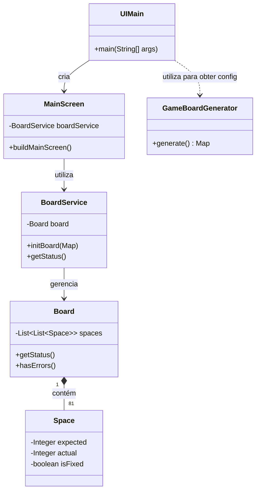

# 🎲 Jogo de Sudoku em Java


## 📝 Descrição do Projeto

Este projeto foi desenvolvido como parte de um desafio da DIO para consolidar os fundamentos da programação em Java. O objetivo principal foi construir um jogo de Sudoku funcional, aplicando os princípios da Programação Orientada a Objetos. O jogo pode ser executado tanto via terminal quanto através de uma interface gráfica construída com a biblioteca Swing.

## ✨ Funcionalidades

-   **Motor de Jogo Completo:** Validação de regras de Sudoku em tempo real.
-   **Modo Terminal:** Interface interativa para jogar via console.
-   **Modo Gráfico:** Interface visual desenvolvida com Java Swing.
-   **Gerador de Tabuleiros:** Inicia o jogo com um quebra-cabeças pré-definido.
-   **Funcionalidades Essenciais:**
    -   Iniciar um novo jogo.
    -   Adicionar e remover números.
    -   Verificar o status atual do jogo (com erros, incompleto, finalizado).
    -   Limpar o progresso do tabuleiro.

## 🛠️ Tecnologias Utilizadas

-   **Java 17+**
-   **Java Swing** (para a interface gráfica)
-   **Git e GitHub** (para versionamento)

## 🚀 Como Executar o Projeto

Você pode executar o projeto de duas formas:

**1. Via Terminal (Console)**

```bash
# Navegue até a pasta 'src' do projeto
cd Sudoko_Project/src

# Compile os arquivos Java
javac *.java model/*.java service/*.java util/*.java

# Execute a classe principal do modo console
java Main
```

**2. Com Interface Gráfica (Swing)**

```bash
# Navegue até a pasta 'src' do projeto
cd Sudoko_Project/src

# Compile os arquivos Java, incluindo os da UI
javac *.java model/*.java service/*.java util/*.java ui_custom/screen/*.java ui_custom/panel/*.java ui_custom/input/*.java

# Execute a classe principal da UI
java UIMain
```

**3. Via IDE**
- Importe o projeto em sua IDE (IntelliJ, Eclipse, etc.).
- Para a versão console, execute o método `main` da classe `Main.java`.
- Para a versão gráfica, execute o método `main` da classe `UIMain.java`.


## 🏛️ Arquitetura e Estrutura do Projeto

O projeto foi organizado com uma clara separação de responsabilidades para facilitar a manutenção e escalabilidade.

### Diagrama de Classes Simplificado

O diagrama abaixo ilustra a relação entre as principais classes do sistema.



### Fluxograma de Jogo (Modo Console)

Este fluxograma demonstra o ciclo de vida da interação do usuário com o jogo no terminal.

``mermaid
graph TD;
    A[Início] --> B{Exibir Menu};
    B --> C{Usuário escolhe opção};
    C -- 1. Iniciar Jogo --> D[Chama startGame()];
    C -- 2. Inserir Número --> E[Chama inputNumber()];
    C -- 3. Remover Número --> F[Chama removeNumber()];
    C -- 4. Visualizar --> G[Chama showCurrentGame()];
    C -- 5. Status --> H[Chama showGameStatus()];
    C -- 8. Sair --> I[Finaliza o Programa];
    D --> B;
    E --> B;
    F --> B;
    G --> B;
    H --> B;
``

## 👨‍💻 Autor

Feito por [Manelima](https://github.com/Manelima).

[](https://www.linkedin.com/in/emanuel-ltda/)
